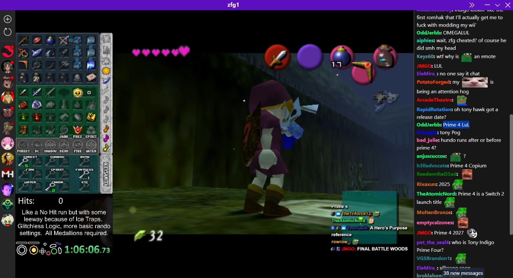
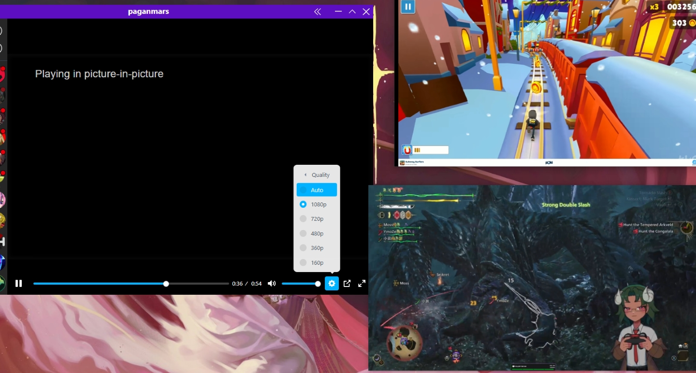

# RT (name pending)

A Twitch and YouTube frontend written in Rust using Tauri and SvelteKit.

<table>
    <tr>
        <td align="center">
            
            <em>
                

                    <a href="https://www.twitch.tv/zfg1">zfg1</a> playing OOT. Chat on Copium for Prime 4.
                

            </em>
        </td>
        <td align="center">
            
            <em>
                

                    <a href="https://www.twitch.tv/paganmars">paganmars</a> playing Monster Hunter Wilds. An excelent use of screen space with PiP.
                

            </em>
        </td>
    </tr>
</table>

## Features

- Add users to your stream and video feeds.
- Watch content in any of the available resolutions.
- View Twitch chat with 7tv and BetterTTV emotes.
- Ad blocking.
- Open videos or streams directly in the app.

## Redirects

On launch, `rt` registers a protocol handler for `rt://` URLs, this allows you to open links in the app.

- YouTube:
  - `rt://yt/dQw4w9WgXcQ`, `rt://youtube/dQw4w9WgXcQ` or full links like `rt://www.youtube.com/watch?v=dQw4w9WgXcQ` and `rt://youtu.be/dQw4w9WgXcQ`.

- Twitch:
  - `rt://tw/zfg1`, `rt://twitch/zfg1` or full links like `rt://www.twitch.tv/zfg1`.

## Download

> All installers (`exe`, `deb`, `rpm`) are provided in the same small zip file.

[Quick download.](https://nightly.link/Kyagara/rt/workflows/build.yaml/main/bundles.zip)

Github Actions builds are available [here](https://github.com/Kyagara/rt/actions).

## About

> Tested on Windows and Ubuntu, not tested on macOS.

#### Data

To store users, feeds and emotes, SQLite is used with [sqlx](https://crates.io/crates/sqlx).

Application data is stored in the following locations:

- Windows: `%AppData%/com.rt.app`
- Linux: `~/.config/com.rt.app`

Logs are stored in the following locations:

- Linux: `$XDG_DATA_HOME/com.rt.app/logs` or `$HOME/.local/share/com.rt.app/logs`
- Windows: `%LocalAppData%/com.rt.app/logs`

#### Frontends

- Youtube:
  - Using the excellent [RustyPipe](https://crates.io/crates/rustypipe) library to interact with YouTube.
  - The feed uses the faster YouTube's rss feed to retrieve videos to avoid rate limits, this sadly does not contain video duration.
  - The player uses [Vidstack](https://github.com/vidstack/player) YouTube [provider](https://vidstack.io/docs/player/api/providers/youtube/) to play the videos via embeds.

- Twitch:
  - The player uses a custom [hls.js](https://github.com/video-dev/hls.js/) loader that communicates with the backend to modify the streams m3u8 manifests, this is what allows for ad blocking as the backend can detect ads and switch to a backup stream until ads are over.
  - The backend uses a PersistedQuery for the feed and a custom query to the Twitch API to retrieve user data and stream playback.

## TODO

- Update screenshots.
- Refactor Player component for both frontends.
- Improve layout (add information about the content somewhere in the watch page).
- Maybe cache users/emotes/feeds in the AppState, also maybe return them when possible in the same request instead of emitting an update event.
- More logging and better errors.
- Youtube:
  - Maybe move from youtube embed to using RustyPipe's botguard and retrieve video URLs using it.
  - Add YouTube channel page with video search.
  - Allow downloading videos/thumbnails.
  - Subscribe to channel from watch page.
  - Add pagination to videos list.
- Twitch:
  - If possible, use a persisted query to retrieve stream playback.
  - Put the seek bar at the end when joining a stream, currently it is some seconds behind when first joining.
  - Add global Twitch emotes.
